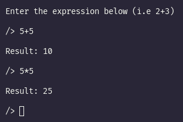

# Simple calculator in C
This is a simple calculator that solve math problems. The app only accept 2 integer numbers and 1 operation.

## Possible operations
- Sum ( + )
- Subtraction ( - )
- Multiplication ( * )
- Division ( / )
- Exponentiation ( ^ )

## Use examples
